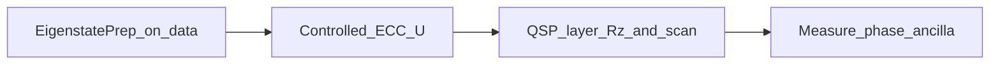

# AlphaShor: Scalable Quantum Cryptanalysis for the Q-Day Prize

## Executive summary

**AlphaShor** targets the **elliptic-curve discrete logarithm problem (ECDLP)** in the spirit of Shor’s period-finding / phase-estimation pipeline. The repository implements a **pure, scalable quantum circuit** for **fixed-point elliptic-curve addition** $U|P\rangle = |P+Q\rangle$ over $\mathbb{F}_p$, built from **reversible modular arithmetic** (QFT-based adders and out-of-place mod-$p$ multiplication). We **do not** synthesize that unitary from a classical transition table.

**Small** target oracles (mock phase gate, Draper adder) use **textbook quantum phase estimation** (controlled-$U^{2^j}$ plus **inverse QFT**). The **wide ECC** stack still uses **Quantum Signal Processing (QSP)** with **iterative binary-search** scans on a **single ancilla**, with optional **depolarizing noise** in simulation. Official competition curve parameters live in [`curves/curves.json`](curves/curves.json); the driver and algorithms are in [`main.py`](main.py). A Q-Day-oriented breakdown (quantum vs classical, hardware vs simulation) is in [**Q-Day Prize submission notes**](#q-day-prize-submission-notes) below.

---

## Core innovations

### 1. QSP-based phase estimation

Textbook **quantum phase estimation (QPE)** with a full **QFT** on multiple readout qubits typically scales the **readout register** with desired precision. **QSP** lets us shape a response polynomial in the signal operator while keeping a **compact** control layout: here, **one phase ancilla** plus the **target register** that carries the oracle unitary.

In code, [`QSPPhaseEstimator`](main.py) supports **`estimate_phase_standard_qpe`** (textbook QPE with [`build_standard_qpe_circuit`](main.py)) for oracles whose width fits the backend, and **`estimate_phase_binary_search`** for the **QSP** sequence (alternating **controlled-$U$** from [`QuantumOracle.construct_circuit()`](main.py) and **$Z$-rotations** from pre-optimized angles) with repeated **`measure_probability(phase_shift)`** calls. **Robustness** for the mock oracle is demonstrated by comparing **noiseless** Aer runs to runs with a **depolarizing** noise model on single- and two-qubit gates (`error_rate` in the estimator).

### 2. Pure quantum field arithmetic (ECC point addition)

[`ECCOracle`](main.py) implements **in-place** point addition $P \mapsto P+Q$ for a **classical fixed** curve point $Q$, on a register encoding $(x,y)$ with **strict mod-$p$** width `strict_mod_p_register_bits(p)` so intermediate additions stay in the range required by the modular-reduction gadgets.

Building blocks include:

- **Draper-style** QFT adders and **double-and-add–style** **mod-$p$** multiplication via **`append_mult_mod_p_out_of_place`** (gate complexity **$O(n^3)$** per multiply, as documented in code).
- **Strict mod-$p$** addition and reduction using **`append_add_constant_mod_p`**, **`append_add_into_mod_p`**, and **`append_subtract_p_with_borrow_addback`**.

**Important:** modular multiplication for slope and line arithmetic is **mod $p$**, not mod $2^n$: we do **not** route the ECC path through [`ModularMultiplierOracle`](main.py), which assumes **$N=2^n$**.

### 3. Fermat inverse and Bennett-style uncomputation

The slope $\lambda$ uses **$(\Delta x)^{-1} \bmod p$**. We avoid a reversible extended-Euclidean gadget chain and instead use **Fermat’s little theorem**: $x^{-1} \equiv x^{p-2} \pmod p$ for prime $p$, implemented as **`append_mod_p_fermat_inverse`** (and wrapped for benchmarking as [`ModPInverseOracle`](main.py)), using repeated **out-of-place mod-$p$** multiplies and dedicated borrow wires.

Arithmetic leaves **ancilla garbage**. [`ECCOracle.construct_circuit`](main.py) therefore follows a **Bennett-style** pattern: run a **forward** block that writes $(x_r,y_r)$ into zero-initialized output registers, **SWAP** the **data** registers with those outputs, then apply **`forward.inverse()`** on the **same** work and ancilla space so junk is uncomputed while the **result** remains on the original **data** wires—preserving **unitarity** and **phase coherence** needed for controlled-$U$ in QSP.

---

## Strict compliance: no classical shortcuts for the ECC unitary

We **do not** use:

- Classical **pre-computed lookup tables** of basis transitions (the legacy **`_build_lookup`** / **`mcx`-per-entry** pattern has been **removed** from the ECC path).
- **Transition matrices** that encode $P \mapsto P+Q$ as classical tabulation wired into quantum controls.

What **is** classical and allowed:

- **Curve parameters** and fixed **$Q$** (same as any implemented oracle definition).
- **Subgroup point enumeration** $\langle Q \rangle$ **only** to build the **$k=1$** eigenstate coefficients in **`prepare_eigenstate`**, which calls **`initialize`** on the **first $2\cdot n_{\mathrm{arith}}$** target qubits (data plane); ancillas remain $|0\rangle$.

The **measured phase statistics** in the ECC demo arise from applying the **quantum arithmetic** unitary (superposition over subgroup points) inside the **QSP** loop—not from indexing a precomputed classical map.

---

## Hardware considerations and execution strategy

**Circuit depth and width.** Mod-$p$ multiplication and Fermat inversion require **many ancilla qubits** and deep QFT-based stages. As implemented, the **full** ECC oracle plus QSP is **not** a shallow NISQ experiment: it is an **architecture** aimed at **scalable** compilation and simulation, not a claim of fitting today’s superconducting **coherence** budgets end-to-end.

**Simulation (Qiskit Aer).**

- **`QSPPhaseEstimator`** uses the default **`AerSimulator()`** (statevector) when the total width is small; for **wide** targets ($1 + n_{\mathrm{tgt}} > 34$) it switches to **`matrix_product_state`** so shots are at least *runnable* (still costly for deep QSP sequences).
- **`ECCOracle`** allocates **data + ancillas**; `main.py` prints a **memory warning** when the oracle’s target qubit count is large. On typical laptops, **end-to-end ECC + QSP** on the **official** JSON curves may **exhaust statevector memory**—this is a **simulation resource** limit, not an assertion that the construction is classical.
- **`AerSimulator(method="matrix_product_state")`** is used in **`__main__`** for the **ModPInverseOracle** regression block (wide inverse circuit). It is **not** currently wired into **`QSPPhaseEstimator`** for ECC; extending the estimator with an **optional MPS (or other tensor) backend** is a natural follow-up for wide-stack runs.

**Stress testing.** Set **`RUN_ECC_STRESS_TEST = True`** in `if __name__ == "__main__"` to sweep **Q-Day** bit lengths (timeouts / memory may stop the sweep early).

**IBM Quantum.** Export **`RUN_ON_IBM_HARDWARE=1`** and set **`IBM_QUANTUM_TOKEN`** in a **`.env`** file. Before local demos, the driver submits **SamplerV2** jobs on a **least-busy** backend using the **official 4-bit prime** from [`curves/curves.json`](curves/curves.json): (1) **strict mod-$p$ add** on a basis state, (2) **`ModPAdderOracle`** + **standard QPE**, (3) **`MockPhaseOracle`** + **standard QPE**. The **full ECC oracle** is **not** executed on IBM hardware (width/depth); see [**Q-Day Prize submission notes**](#q-day-prize-submission-notes) for the honesty statement and a **job log template**.

---

## Usage

### Environment

- Use **Python 3.10–3.12** if possible (see comments in [`requirements.txt`](requirements.txt); some Qiskit / Aer builds are unreliable on **3.14+**).
- Create a virtual environment and install dependencies:

```bash
python3.12 -m venv .venv
source .venv/bin/activate   # Windows: .venv\Scripts\activate
pip install -r requirements.txt
```

### Run the demonstration driver

```bash
python main.py
```

### Submission evidence log

The file [`submission_evidence.txt`](submission_evidence.txt) is a **captured run** used for Q-Day Prize submission. Regenerate it (after installing dependencies) with:

```bash
ALPHASHOR_SUBMISSION_EVIDENCE=1 PYTHONUNBUFFERED=1 python -u main.py > submission_evidence.txt 2>&1
```

Leave **`RUN_ON_IBM_HARDWARE` unset** for this capture so the log stays **simulation-only** (no IBM Quantum queue or warnings). Optional: **`ALPHASHOR_EVIDENCE_MEASURE=1`** adds a few **MPS** `measure_probability` samples on the wide ECC stack (slow).

That mode uses the **official 4-bit Q-Day curve** from [`curves/curves.json`](curves/curves.json): it records **Aer-backed** simulation for the **mock textbook QPE** demo and arithmetic regression blocks, **builds** the full **`ECCOracle`** circuit (wire count, depth, gate count), and validates **subgroup order $r=7$** against JSON via the **continued-fraction** post-processing chain on the **expected $k=1$** eigenphase $2\pi/r$, then runs **classical** exhaustive **ECDLP** recovery for small $r$. Full iterative QSP on the wide arithmetic oracle is **skipped** in this mode because each shot is prohibitively expensive at current widths; run `python main.py` **without** `ALPHASHOR_SUBMISSION_EVIDENCE` on suitable memory or tensor-network backends for end-to-end QSP.

### What `main.py` prints (order of sections)

0. **IBM Quantum** (only if **`RUN_ON_IBM_HARDWARE=1`** and **`IBM_QUANTUM_TOKEN`** is set)  
   **`SamplerV2`** on a **least-busy** backend: **strict mod-$p$ add** (official prime), **`ModPAdderOracle`** + **standard QPE**, **`MockPhaseOracle`** + **standard QPE**; logs **job_id** lines.

1. **Mock phase oracle — textbook QPE**  
   Ideal (**0%**) vs **2% depolarizing** on the **same QPE circuit**; reports **phase error** in radians and degrees.

2. **ECC + QSP** (when **`RUN_ECC_STRESS_TEST`** is **`False`**, the default)  
   Loads **`curves/curves.json`** via **`load_qday_curves`**. Default prime size is **`QDAY_CURVE_BITS = 4`**; for **6-bit**, change that constant (or call **`load_qday_curves(bit_length=6)`** in code).  
   Prints oracle **qubit count**, **expected** $2\pi/r$, **ideal / noisy** phase estimates (QSP + binary search when not in submission-evidence mode), **continued-fraction** candidates for **$k/r$**, whether **$r$** matches the JSON **subgroup order**, and **classical** **$d$** recovery by exhaustive search on **$Z_r$** (JSON **`private_key`** is verification-only).

3. **Arithmetic validation demos** (regression-style prints)  
   **`ScalableAdderOracle`**, **`ModPAdderOracle`**, **`ModularMultiplierOracle`**, **`StrictModPAdderOracle`**, then **`ModPInverseOracle`** with **MPS** Aer and **✓/✗** checks.

### Configuration toggles (`main.py`, `if __name__ == "__main__"`)

| Flag | Role |
|------|------|
| **`RUN_ECC_STRESS_TEST`** | In code: **`False`**: run single-curve ECC QSP demo. **`True`**: sweep multiple Q-Day bit lengths (heavy). |
| **`RUN_ON_IBM_HARDWARE`** | Env: **`1`/`true`/`yes`**: IBM **SamplerV2** jobs (official **$p$** mod-$p$ gadget, **ModP** QPE, mock QPE); requires **`.env`** token. |
| **`ALPHASHOR_SUBMISSION_EVIDENCE`** | Env: **`1`/`true`/`yes`**: lower ECC QSP cost, skip wide iterative QSP; use when capturing [`submission_evidence.txt`](submission_evidence.txt). |
| **`ALPHASHOR_EVIDENCE_MEASURE`** | Env: **`1`/`true`/`yes`**: with submission evidence, run a few **MPS** `measure_probability` calls on **`ECCOracle`** (optional, slow). |
| **`QDAY_CURVE_BITS`** | ECC demo curve size when not stress-testing (e.g. **4** or **6**). |

### What “success” looks like

- **Mock QPE:** Small **phase error** after **standard QPE**; noisy case **degraded** vs noiseless.
- **ECC QSP:** Estimated phase close to **$2\pi/r$** (mod $2\pi$); continued fractions may recover **$r$** matching **`subgroup_order`** in JSON.
- **Arithmetic blocks:** Printed **✓** for each checked basis state / modulus line.

### QSP–ECC data flow (high level)



---

## Repository map

| Path | Content |
|------|---------|
| [`main.py`](main.py) | QSP angles, oracles (**`ECCOracle`**, adders, inverse), **`QSPPhaseEstimator`**, textbook QPE helper, `__main__` driver |
| [`tests/test_phase_qpe.py`](tests/test_phase_qpe.py) | Unit test for mock **standard QPE** (`python -m unittest tests.test_phase_qpe -v`) |
| [`curves/curves.json`](curves/curves.json) | Official-format Q-Day curve entries |
| [`requirements.txt`](requirements.txt) | Python dependencies |
| [`submission_evidence.txt`](submission_evidence.txt) | Regenerated evidence log (see **Submission evidence log** under Usage) |
| [`LICENSE`](LICENSE) | MIT License (2026, AlphaShor Contributors) |

This project is released under the [MIT License](LICENSE).

---

## Competition reference

**Q-Day Prize** — objective, rules, and submission expectations: [https://www.qdayprize.org/](https://www.qdayprize.org/)

---

## Q-Day Prize submission notes

The following maps this repository to public [Q-Day Prize](https://www.qdayprize.org/) expectations (gate-level code, approach, execution environment). Reconcile wording with the official **Submit** page and **rubric** when they are updated.

### What is quantum vs classical

| Piece | Role |
|------|------|
| **`ECCOracle.construct_circuit()`** | Quantum: reversible mod-$p$ elliptic-curve point map $P \mapsto P+Q$ (no transition-table unitary). |
| **Eigenstate prep** (`prepare_eigenstate`) | Classical description of amplitudes; implemented with `initialize` on the data register (allowed curve/subgroup data). |
| **Wide ECC + QSP** (`QSPPhaseEstimator`, `backend_type=local`) | Quantum sampling (Aer statevector or **MPS** when $1+n_{\mathrm{tgt}}>34$). |
| **Textbook QPE** (`estimate_phase_standard_qpe`) | Quantum: controlled-$U^{2^j}$ + inverse QFT; used for **small** oracles (mock phase gate, scalable adder, IBM `ModPAdder` demo). |
| **Continued fractions** | Classical post-processing on a measured (or, in evidence-only mode, stated) phase to recover $k/r$. |
| **`classical_discrete_log_bruteforce`** | Classical exhaustive search for $d$ with $d\cdot G = Q$ once $r$ is known (feasible for toy subgroup orders in the official JSON). |

### Hardware vs simulation

- **Full-width `ECCOracle` + iterative QSP** is **not** run end-to-end on current IBM superconducting backends (hundreds of qubits / depth). It is demonstrated on **Qiskit Aer** (statevector or MPS as selected in code).
- **`RUN_ON_IBM_HARDWARE=1`** runs **Qiskit Runtime `SamplerV2`** jobs that are tied to the **official 4-bit prime** $p$ from [`curves/curves.json`](curves/curves.json):
  1. **Strict mod-$p$ add** gadget (`append_add_constant_mod_p`) on a computational basis state (dominant outcome should be $(x+C)\bmod p$).
  2. **`ModPAdderOracle(p, C)`** with **standard QPE** (controlled powers + inverse QFT).
  3. **`MockPhaseOracle`** with **standard QPE** as a sanity check.

Record **`job_id`**, **backend name**, **shots**, and (if required) **instance/plan** in your external lab notebook or submission form.

#### Hardware log template (copy/paste)

```
Date (UTC):
Backend:
Job IDs:
  - strict_mod_p_add:
  - modp_qpe:
  - mock_qpe:
Shots per job:
IBM Quantum instance / plan (if applicable):
```

### Reproducibility (submission-oriented)

| Goal | Command |
|------|---------|
| Default local demo | `python main.py` |
| Submission-style log (no IBM) | `ALPHASHOR_SUBMISSION_EVIDENCE=1 PYTHONUNBUFFERED=1 python -u main.py > submission_evidence.txt 2>&1` |
| Optional MPS `measure_probability` lines in evidence | Add `ALPHASHOR_EVIDENCE_MEASURE=1` (slow). |
| IBM block (requires `.env` token) | `RUN_ON_IBM_HARDWARE=1 PYTHONUNBUFFERED=1 python -u main.py` |
| Unit test (mock QPE) | `python -m unittest tests.test_phase_qpe -v` |

Leave **`RUN_ON_IBM_HARDWARE` unset** when regenerating [`submission_evidence.txt`](submission_evidence.txt) unless you intend to mix IBM queue output into that file.

### Files reviewers may prioritize

- [`main.py`](main.py) — oracles, `QSPPhaseEstimator`, `build_standard_qpe_circuit`, driver.
- [`curves/curves.json`](curves/curves.json) — official-format parameters.
- [`submission_evidence.txt`](submission_evidence.txt) — captured simulator run (regenerate with the command above).

This README describes the **AlphaShor** submission architecture: **textbook QPE** on small oracles, **single-ancilla QSP** for the wide ECC path, **lookup-free mod-$p$** ECC arithmetic, **Fermat inverse**, and **Bennett uncompute**, with **honest** simulation and **IBM** gadget validation as implemented in this repository.
